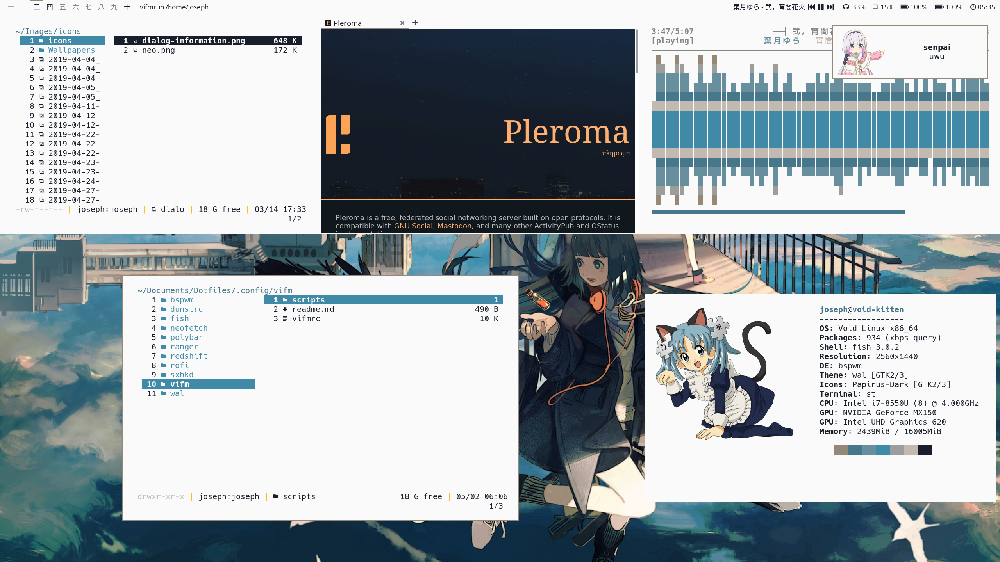

# My Dotfiles

nothing original

pywal generates colors from a random wallpaper in ~/Images/Wallpapers/papes at startup

pape script (in .local/bin) can be used with a wallpaper as first argument to load colors on bspwm and dunst

