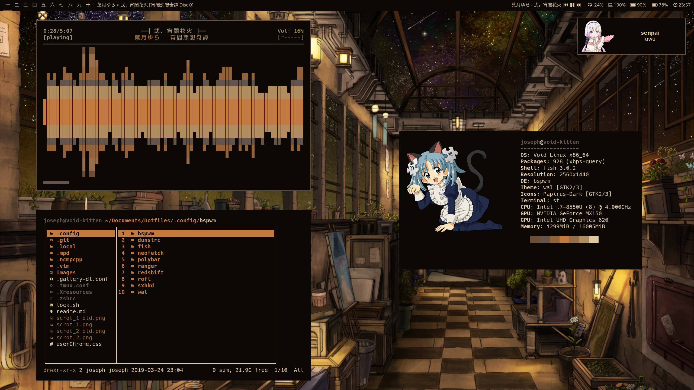

# My Dotfiles

nothing original

## Install

require stow
```sh
./install.sh
```

I use a [patched st](https://github.com/josephobriot/st_custom), don't forget to install the symbola font so that it doesn't crash when displaying emojis. 

Also [j4-dmenu-desktop](https://github.com/enkore/j4-dmenu-desktop) for program launching with [custom dmenu](https://github.com/josephobriot/dmenu_custom)


pywal generates colors from a random wallpaper in ~/Images/Wallpapers/papes at startup  

don't forget too add this in your `.config/mimeapps.list` under Default Application
```
x-scheme-handler/magnet=torrent.desktop
application/x-bittorrent=torrent.desktop
```

pape script (in .local/bin) can be used with a wallpaper as first argument to load colors on bspwm and dunst




programs to install ([raw list in deps](https://github.com/josephobriot/Dotfiles/blob/master/deps)) :

 - xrdb
 - xset
 - setxkbmap
 - xbacklight
 - compton
 - NetworkManager
 - network-manager-applet
 - gnome polkit thing
 - feh
 - xdotool
 - xwininfo
 - bash
 - NotoSansCJK font
 - OpenSans font
 - ueberzug
 - ahoviewer
 - stow (installation)
 - pcmanfm
 - maim
 - imagemagick
 - scrot
 - i3lock
 - bspwm or herbstluftwm
 - transmission-daemon
 - my st fork

contains config for the programs below :

 - bspwm
 - sxhkd
 - herbstluftwm
 - polybar
 - dunst
 - fish
 - zsh
 - tmux
 - gallery-dl
 - neofetch
 - mpd
 - ncmpcpp
 - ranger
 - vifm
 - redshift (very aggressive color change, you might want to not use it)
 - rofi
 - pywal
